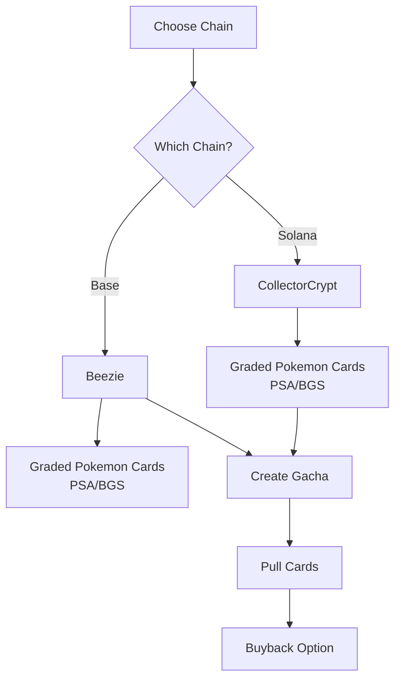

# Chain Support

CLAW MACHINE supports multiple blockchains. Each chain has specific providers and NFT types.

## Supported Chains

| Chain | Providers | Status | Vault |
|-------|-----------|--------|-------|
| Solana | CollectorCrypt | ✅ Live | TEE Vault (Solana) |
| Base | Beezie | 🏗️ Coming Soon | TEE Vault (Base) |

## Chain-Provider Mapping

Each blockchain supports different NFT providers:



## Solana

**Provider:** CollectorCrypt

- Graded Pokemon card NFTs with insured FMV
- On-chain metadata with value attestation
- Available on: MagicEden, Solanart, Tensor

### Example: Create Solana Gacha

```json
{
  "name": "Vintage Charizard Claw",
  "description": "PSA graded cards",
  "tier": "legendary",
  "price_usd": 50,
  "buyback_rate": 0.90,
  "source_nfts": [
    {
      "mint": "7xKpMK1gV...",
      "chain": "solana",
      "provider": "collectorcrypt",
      "name": "Charizard PSA 9",
      "image": "https://...",
      "estimatedValue": 60
    }
  ]
}
```

## Base (Coming Soon)

**Provider:** Beezie

- Cross-chain graded Pokemon cards
- EVM-native NFTs
- Purchased via Beezie.io marketplace

### Expected Example: Create Base Gacha

```json
{
  "name": "Base Pokemon Claw",
  "description": "Beezie graded cards",
  "tier": "premium",
  "price_usd": 25,
  "buyback_rate": 0.90,
  "source_nfts": [
    {
      "mint": "0x1234...",
      "chain": "base",
      "provider": "beezie",
      "name": "Pikachu PSA 10",
      "image": "https://...",
      "estimatedValue": 100
    }
  ]
}
```

## Important Notes

### Single Chain Per Gacha

Each gacha pack must contain NFTs from a **single chain**. You cannot mix Solana and Base NFTs in the same gacha.

### Chain Selection at Creation

When creating a gacha, all NFTs must have the same `chain` value:

- ✅ Valid: All `chain: "solana"`
- ✅ Valid: All `chain: "base"`  
- ❌ Invalid: Mixed chains

### Buyback

Buybacks work on both chains:
- Solana: NFT transferred to platform vault
- Base: NFT transferred to Base vault (when available)

### Payment

Payments are handled via x402 protocol and can be made in:
- USDC on Solana
- USDC on Base (when available)

## Provider Comparison

| Feature | CollectorCrypt (Solana) | Beezie (Base) |
|---------|------------------------|---------------|
| NFT Type | SPL Tokens | ERC-721 |
| Grading | PSA, BGS | PSA, BGS |
| FMV Model | On-chain insured | On-chain insured |
| Marketplace | MagicEden | Beezie.io |
| Status | Live | Coming Soon |

## FAQ

**Q: Can I create a gacha with cards from both Solana and Base?**

No. Each gacha must use NFTs from a single chain. Create separate gachas for each chain.

**Q: When will Base support be available?**

Base support is planned after TEE vault deployment for Base chain. Follow @mysterygift for updates.

**Q: Can I buy packs on one chain and pull on another?**

No, purchases and pulls happen on the same chain as the gacha.

**Q: What's the difference between providers?**

Both offer graded Pokemon cards with insured FMV. The main difference is the blockchain:
- CollectorCrypt: Solana (lower fees, fast)
- Beezie: Base (EVM ecosystem)
