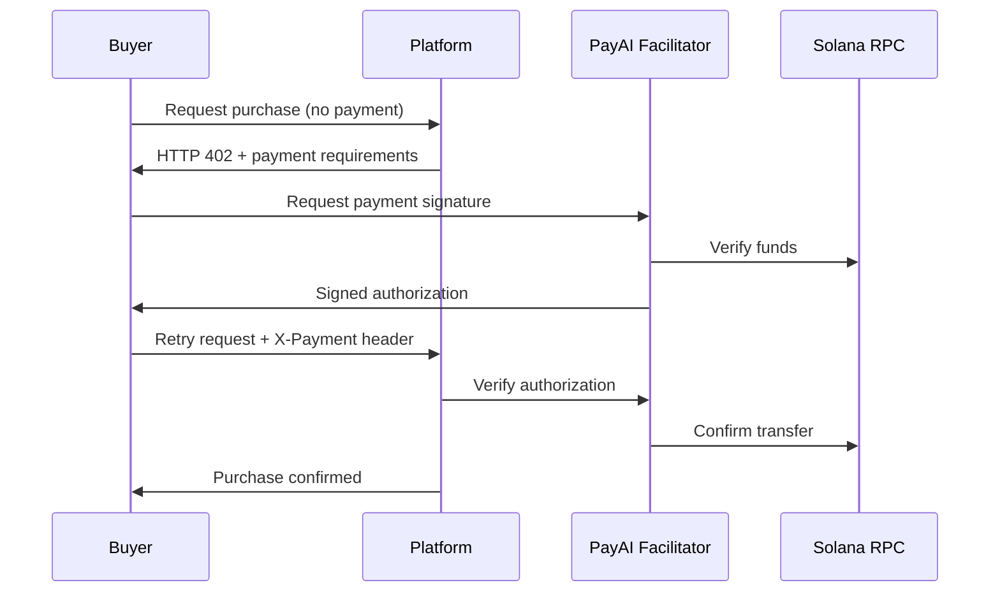

# How It Works

Understanding the CLAW MACHINE architecture.

## Core Architecture

```
┌──────────────────────────────────────────────────────────────────────────┐
│                              GACHA CREATION                               │
├──────────────────────────────────────────────────────────────────────────┤
│                                                                          │
│  1. Creator provides NFTs (must be in TEE vault)                         │
│  2. Platform verifies vault ownership                                     │
│  3. Solvency check: price × cards × 0.99 ≥ sum(values) × buyback         │
│  4. 24-hour cooldown begins                                               │
│  5. Gacha goes live                                                       │
│                                                                          │
└──────────────────────────────────────────────────────────────────────────┘
                                    │
                                    ▼
┌──────────────────────────────────────────────────────────────────────────┐
│                              PACK PURCHASE                                │
├──────────────────────────────────────────────────────────────────────────┤
│                                                                          │
│  1. Buyer requests purchase                                               │
│  2. Platform returns x402 payment requirement (HTTP 402)                 │
│  3. Buyer signs USDC transaction                                          │
│  4. Platform verifies payment on-chain                                   │
│  5. Purchase recorded (30-minute payment window)                          │
│                                                                          │
└──────────────────────────────────────────────────────────────────────────┘
                                    │
                                    ▼
┌──────────────────────────────────────────────────────────────────────────┐
│                                PACK PULL                                  │
├──────────────────────────────────────────────────────────────────────────┤
│                                                                          │
│  1. Buyer requests pull                                                   │
│  2. TEE Randomness generates verifiable seed (Intel TDX)                 │
│  3. Card index = seed % pool_size                                         │
│  4. Optimistic lock removes card from pool                                │
│  5. NFT transferred from vault to buyer wallet                            │
│  6. On-chain transfer verified                                            │
│                                                                          │
└──────────────────────────────────────────────────────────────────────────┘
                                    │
                                    ▼
┌──────────────────────────────────────────────────────────────────────────┐
│                               BUYBACK                                     │
├──────────────────────────────────────────────────────────────────────────┤
│                                                                          │
│  1. Buyer requests buyback                                                │
│  2. Platform returns vault address and price                              │
│  3. Buyer transfers NFT to vault                                          │
│  4. On-chain transfer verified                                            │
│  5. Buyback recorded as pending_payout                                    │
│  6. Admin processes payout (manual batching)                              │
│                                                                          │
└──────────────────────────────────────────────────────────────────────────┘
```

## TEE Verifiable Randomness

Every pack pull uses hardware-backed randomness from Phala Network:

1. **Request**: Buyer requests a pull
2. **TEE Seed**: Intel TDX enclave generates random seed
3. **Attestation**: TEE returns seed + cryptographic proof
4. **Verification**: Platform verifies attestation
5. **Selection**: `card_index = seed % pool_size`
6. **Transfer**: NFT moved to buyer's wallet

This ensures **no manipulation** — neither the platform nor the creator can predict or influence outcomes.

## NFT Vault Architecture

All creator NFTs are held in a **single shared vault wallet**:

| Aspect | Implementation |
|--------|----------------|
| Private Key | Held exclusively inside TEE enclave |
| Transfers | Only via TEE-signed transactions |
| Access | Authorized by `TEE_VAULT_API_KEY` bearer token |
| Health | Monitored via `/health` endpoint |

## Payment Flow (x402 Protocol)

CLAW MACHINE uses the [x402 protocol](https://x402.org) for payments:



## Solvency Enforcement

The platform enforces solvency at **gacha creation**:

```
REQUIRED: price × total_cards × 0.99 ≥ sum(card_values) × buyback_rate
```

**Example:**
- 20 cards, $25 each, 90% buyback
- Required pool value: (20 × $25 × 0.99) / 0.90 = **$550**
- If your 20 cards are worth $550+ FMV, you're good

This protects buyers by ensuring the creator can cover buybacks.

## What Gets Verified

| Check | What It Ensures |
|-------|-----------------|
| NFT Vault Ownership | Creator actually owns deposited cards |
| Solvency Formula | Creator can cover buybacks |
| On-chain Payment | Buyer actually paid |
| TEE Randomness Seed | Pull is fair and unpredictable |
| NFT Transfer (pull) | Buyer receives their card |
| NFT Transfer (buyback) | Creator receives returned card |

## What Is NOT Verified

| Gap | Note |
|-----|------|
| Card Values | Self-reported by creator at gacha creation |
| SOL/USD Price | Direct comparison (no oracle) |

Always verify card values independently before creating a gacha.

## Next Steps

- [Economics](economics.md) — Revenue breakdown
- [Solvency & Safety](solvency.md) — Platform guarantees
- [Mystery Gift Integration](mystery-gift-integration.md) — Pack purchasing