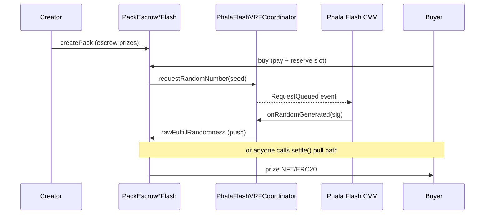

# Randomness Architecture (Flash VRF + TEE + Commit-Reveal)

**Source of truth for how pack opens get entropy.**  
If marketing copy conflicts with this page, **this page wins**.

## TL;DR

| Layer | What it is | Used for |
| --- | --- | --- |
| **PackEscrow*Flash** + **PhalaFlashVRFCoordinator** | On-chain request → TEE-signed fulfill → settle | **Permissionless packs** (Base NFT, RH equity/meme) |
| **PackEscrow721 / PackEscrow20** (commit-reveal) | Buyer commit → delay → reveal | MVP / fallback without Flash CVM |
| **Phala TEE RNG HTTP** (`rng.mysterygift.fun`) | Off-chain verifiable seed API (x402) | Miss tools, raffles, analysis — **not** pack custody |
| **Chainlink VRF** | Classical ECVRF (where supported) | Optional on **Base**; **not on Robinhood** today |
| **TEE vault wallet** | Hot wallet signing NFT transfers | **Not** for public packs — see [Vault Lifecycle](vault-lifecycle.md) |

## Product lanes

| Lane | Chain | Escrow | Payment | Randomness (preferred) |
| --- | --- | --- | --- | --- |
| TCG / graded NFT packs (Pokemon, One Piece, Beezie-class) | **Base `8453`** | `PackEscrow721Flash` | USDC | Phala Flash (or commit-reveal) |
| Equity / stock-token packs | **Robinhood `4663`** | `PackEscrow20Flash` | USDG | Phala Flash |
| AI agent / meme token packs (cashcat, hoodies, vexai, …) | **Robinhood `4663`** | `PackEscrow20Flash` | USDG | Phala Flash |

Base and RH are **separate** deployments. No atomic cross-chain open in v1.

## Phala Flash VRF (what it is / is not)

### What it is

Phala Cloud **Flash VRF** template pattern:

1. Consumer calls `requestRandomNumber(seed)` on `PhalaFlashVRFCoordinator`
2. Coordinator emits `RequestQueued`
3. Phala **TEE CVM** listens, computes deterministic random under enclave key, ECDSA-signs `(requestId, seed, random)`
4. Anyone submits `onRandomGenerated(requestId, random, signature)`
5. Contract verifies signature recovers to registered `offchainPublicKey`, stores random, optionally **pushes** `rawFulfillRandomness` to consumer

Latency claim (Phala): **~2–4 seconds** on tested EVM L2s.

Implementation in this repo:

- `contracts/src/randomness/PhalaFlashVRFCoordinator.sol`
- `contracts/src/interfaces/IPhalaFlashVRF.sol`
- `contracts/src/PackEscrow721Flash.sol`
- `contracts/src/PackEscrow20Flash.sol`

Upstream template: [Phala-Network/phala-cloud-vrf-template](https://github.com/Phala-Network/phala-cloud-vrf-template)

### What it is not

- **Not** Chainlink ECVRF (no DON, no LINK premium schedule)
- **Not** “trust nothing” — you trust **Intel TDX / Phala TEE + key registration + CVM liveness**
- **Not** a replacement for the **HTTP RNG service** used by Miss / raffles
- **Not** a vault — it does **not** hold NFTs or tokens

### Cost model

| Cost | Who pays | Notes |
| --- | --- | --- |
| Phala CVM rent | Operator | ~hourly (same class as other Phala Cloud apps); **not per-request** |
| `requestRandomNumber` gas | Buyer (via `buy`) | L2 gas on Base or RH |
| `onRandomGenerated` gas | TEE wallet / relayer | Fund TEE wallet with chain native ETH |
| Premium | — | **None** (unlike Chainlink % premium) |

**Robinhood:** gas is ETH (L2 + L1 data fee). Expect **very low** marginal cost per open (sub-cent to low cents in normal conditions). Deploy buffer: **~0.01–0.05 ETH** for contracts + early fulfills.

**Chainlink on Base (if chosen later):** gas × (1 + premium%), typically ~50–60% premium on L2s. Stronger brand; **unavailable for VRF on RH**.

### Deploy / operate checklist

1. Deploy `PhalaFlashVRFCoordinator` (owner = multisig eventually)
2. Deploy `PackEscrow721Flash` (Base) and/or `PackEscrow20Flash` (RH) with `vrf` = coordinator
3. Deploy Phala Cloud Flash VRF CVM from template; set `RPC_URL` + `CONTRACT_ADDRESS`
4. `GET /get_wallet` → fund with gas ETH on target chain
5. `GET /pubkey` → `updateOffchainPublicKey` + optional `setTrustedTEE`
6. Smoke: create pack → buy → wait fulfill → settle (or rely on push callback)
7. Monitor: pending requests, CVM health, TEE wallet balance, `FULFILL_TIMEOUT` refunds

Script: `contracts/script/DeployFlashVRF.s.sol`

```bash
cd contracts
export PRIVATE_KEY=...
export FEE_RECIPIENT=0x...
export PAYMENT_TOKEN=0x...   # Base USDC or RH USDG
export DEPLOY_721=true
export DEPLOY_20=false
forge script script/DeployFlashVRF.s.sol:DeployFlashVRF --rpc-url $RPC_URL --broadcast
```

## Pack open flows

### Flash path (preferred for production packs)



**Reservation:** `buy` increments `reserved` so concurrent buyers cannot oversubscribe inventory. Refund after `FULFILL_TIMEOUT` only if VRF never fulfilled; if random is already known, refund forces settle (no free option).

### Commit-reveal path (fallback / lighter ops)

See [Escrow V2](escrow-v2.md). No Flash CVM required. Weaker marketing claim; still uniform over remaining and no operator-picked index after payment.

## Comparison matrix

| | Commit-reveal | Phala Flash | Chainlink VRF | TEE HTTP RNG |
| --- | --- | --- | --- | --- |
| On-chain settle | Yes | Yes | Yes | No |
| Operator cannot pick prize after pay | Yes (buyer entropy) | Yes (TEE) | Yes (crypto VRF) | N/A |
| Works on Robinhood | Yes | Yes (EVM) | **No** | Yes (off-chain) |
| Extra infra | None | Flash CVM | Chainlink sub | Existing RNG CVM |
| Honest claim | “Buyer commit-reveal” | “TEE-signed Flash VRF” | “Chainlink VRF” | “Verifiable seed API” |

## Forbidden claims until true

- “Chainlink VRF on Robinhood”
- “Provably fair with zero trust assumptions” for Flash (TEE is a trust root)
- “TEE vault holds your pack NFTs” for public product
- “Flash replaces Miss randomness API” (different surfaces)

## Edge cases (operators + integrators)

| Case | Mitigation |
| --- | --- |
| Flash CVM down after `buy` | Buyer (or anyone via `refundStale`) after `FULFILL_TIMEOUT`; monitor pending age |
| Pause after buy | `settle` paused; **refund / refundStale still work** |
| Random fulfilled but push fails | Public `settle(purchaseId)` pull path |
| Free option after random known | `refund` / `refundStale` **force settle** if fulfilled |
| Stuck reservation | `refundStale` frees slot so creator can cancel |
| Concurrent oversell | `reserved` on buy (Flash **and** commit-reveal) |
| Key rotation mid-flight | Drain pending before `updateOffchainPublicKey` |
| TEE gas empty | Fund TEE wallet; UI status on rng.mysterygift.fun Flash mode |
| Junk / fee-on-transfer ERC-20 | Document; prefer standard tokens |
| Restricted stock tokens | Off-chain `oraclePaused` check before create |
| HTTP seed ≠ pack open | Dual-mode landing labels HTTP vs Flash |

## RNG app page

`https://rng.mysterygift.fun` EXECUTE mode toggle:

- **HTTP API / x402** — Miss, raffles, dice/pick (live)
- **On-chain Flash VRF** — coordinator status, request lookup, on-chain request (gas)

## See also

- [Vault Lifecycle](vault-lifecycle.md) — do we still need the vault wallet?
- [Flash VRF Ops](flash-vrf-ops.md)
- [Escrow V2](escrow-v2.md)
- [Product Narrative](narrative.md)
- [Chain Support](chain-support.md)
